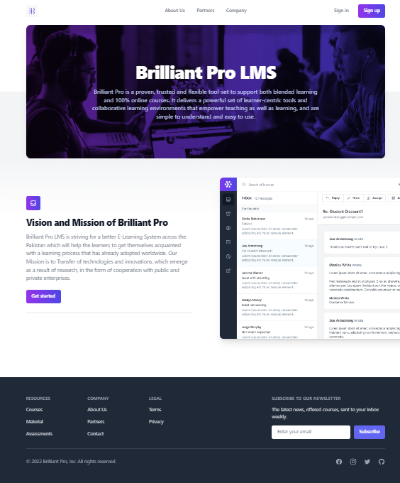

# Brilliant Pro LMS
Brilliant Pro is a proven, trusted and flexible tool-set 
to support both blended learning and 100% online courses. 
It delivers a powerful set of learner-centric tools and 
collaborative learning environments that empower teaching 
as well as learning, and are simple to understand and easy to use.
The primary purpose of this LMS is to effectively create and manage e-Learning courses ,learning
material and assessment. Therefore, administrators will construct and manage courses and content.

## Working
The Brilliant Pro LMS works in two different modes for 
Admins and Learners respectively. 

• Learners are the end-users. These are the users for whom the 
training content is designed. They are the recipients of the 
training and access the LMS to view learning material and
participate in the course work and assessments, all while 
tracking their own progress along the way.

• Administrators are in charge for the management of the LMS, 
which includes multiple tasks ranging from course creation, 
to learner assignment, to monitoring learner progress.

## Preview
